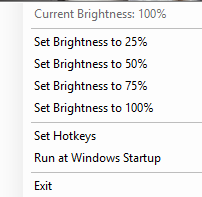

#  BrightnessHotKeys

A lightweight Windows application that allows you to control your monitor's brightness using customizable global hotkeys. The app supports both internal laptop displays and external monitors via DDC/CI.

## Features
1. __Global Hotkeys__: Adjust brightness up or down using customizable keyboard shortcuts.
2. __Visual Brightness Indicator__: Displays a progress bar in the bottom-right corner of the screen when brightness is adjusted.
3. __Multiple Preset Brightness Levels__: Quickly set brightness to 25%, 50%, 75%, or 100% from the tray menu.
4. __Run at Startup__: Option to automatically start the app when Windows boots.
5. __Current Brightness Detection__: Detects and displays the current brightness level.
6. __Configurable Brightness Step Size__: Customize how much brightness changes with each hotkey press.
7. __Single-Instance Application__: Ensures only one instance of the app runs at a time.
8. __Error Handling__: Displays toast notifications for errors (e.g., failed to load settings or register hotkeys).
9. __User-Friendly Tray Menu__: Access all features and settings from the system tray.

## Screenshots

Example of the tray menu with brightness options.
https://via.placeholder.com/400x300?text=Brightness+Indicator
Visual brightness indicator when adjusting brightness.

## Installation
1.	Download the Latest Release:
Go to the Releases page and download the latest version.
2.	Run the Application:
Double-click the BrightnessHotKeys.exe file to start the application. The app will appear in the system tray.
3.	Optional: Add the app to your startup programs to run it automatically when Windows boots.

## Usage

## Adjusting Brightness
- Use the default hotkeys:
- Increase Brightness: Ctrl + Up Arrow
- Decrease Brightness: Ctrl + Down Arrow
- Customize the hotkeys via the "Set Hotkeys" option in the tray menu.

## Tray Menu Options
- __Set Hotkeys__: Opens a dialog to configure custom hotkeys.
- __Set Brightness to 25%/50%/75%/100%__: Quickly set brightness to a specific level.
- __Run at Windows Startup__: Enable or disable automatic startup.
- __Exit__: Closes the application.

## Visual Brightness Indicator
- A progress bar appears in the bottom-right corner of the screen when brightness is adjusted.

## Requirements
- __Windows 10/11__
- __.NET 9 Runtime__: Download from Microsoft's .NET website.

## Building from Source
1.	Clone the repository:
```   
git clone https://github.com/Unthred/BrightnessHotKeys.git
cd BrightnessHotKeys
```
2.	Open the solution in Visual Studio 2022.
3.	Build the project using the Release configuration.
4.	The compiled executable will be located in the bin\Release\net9.0-windows directory.

## Configuration
The app saves its settings in a JSON file located at:
```%AppData%\BrightnessHotkeys\settings.json```
Example settings.json:
{
  "BrightnessUpKey": "Up",
  "BrightnessDownKey": "Down",
  "LastBrightness": 50
}

## Known Issues
- __DDC/CI Support__: Some external monitors may not support DDC/CI. Ensure DDC/CI is enabled in your monitor's settings.
- __Hotkey Conflicts__: If a hotkey is already in use by another application, it may fail to register.

## Contributing
Contributions are welcome! If you have ideas for new features or find a bug, feel free to open an issue or submit a pull request.
Development Guidelines
- Follow the existing coding style.
- Ensure all new features are thoroughly tested.
- Include comments and documentation for any new code.

## License

This project is licensed under the [MIT License](LICENSE). You are free to use, modify, and distribute this software as long as the original copyright notice is included.

## Acknowledgments
- Monitorian for inspiration on DDC/CI brightness control.
- Microsoft .NET for the development framework.
